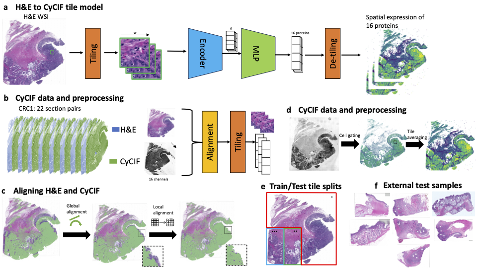

#### Disclaimer

This is not an official Verily product.

# HIPI

[HIPI: Spatially Resolved Multiplexed Protein Expression Inferred from H&amp;E WSIs](https://www.biorxiv.org/content/10.1101/2024.03.26.586744v1)



### Installation

*   Create conda environment:

```
conda env create -f environment.yml
```

*   Install [SimpleITK](https://simpleitk.org/)


### Data preprocessing

*   Download H&amp;Es and CyCIF files from [Lin et al. 2023](https://github.com/labsyspharm/CRC_atlas_2022)
*   Align H&amp;Es and CyCIF images using the `preprocess/align_hne_cycif.sh` script
*   Extract image tiles using the `preprocess/split_hne_to_tiles.sh` script
*   Create a tile feature dataframe table using the `create_tile_measurement_table.py` script

### Training

*   Configuration files for model and training paramaters are in `configs` folder
*   To train HIPI with default parameters run the following (after adjusting the log dir and number of gpus):

```
python cycif_train_main.py --base configs/ssl_vit_mlp8_16channels.yaml --logdir logs -t --gpus 0,1,2,3,
```

### Prediction

Run the `cycif_eval_main.py` script with the model configuration and checkpoint to evaluate. You can choose which dataset to evaluate from the config file (train, validatiob, test) or overwrite in the command line.

```
python cycif_eval_main.py --cfg_file configs/ssl_vit_mlp8_16channels.yaml --ckpt_file "${ckpt_file}" --test_csv "${test_csv}" --num_workers 4 --out_path "${out_path}" --batch_size 512 --device cuda:0 --datasets "${dataset}"
```

### Trianed model

Weights for the tranied model are in `models/HIPI_model.ckpt`


